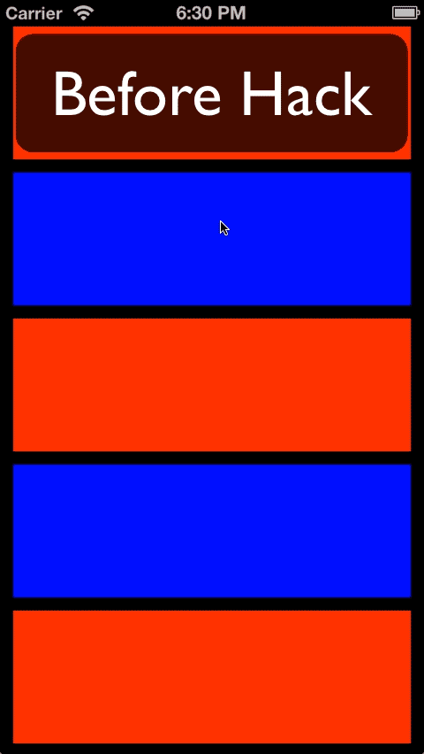

# Collection View Animation Bug Sample Code

## The bug

There's a bug (confirmed by Apple) in the otherwise excellent `UICollectionView`'s `performBatchUpdates` method which causes cells that are initially off-screen animating on-screen to just appear at their final location instead of animating there. This is better understood visually:



Notice how the last cell doesn't animate when reappearing? This is a simple demo, but there are cases in which the bug is drastically more jarring.

## The demo project

This demo project is the result of having tried tons of work-arounds to get this animation to work, when finally the best solution was the crudest.

## The fix

The solution is really more of a hack: make the collection view bigger during the animation so that it can accurately animate the appearing cells.

Essentially:

``` objc
frameUpdate.size.height += kExpandedHeight - kCollapsedHeight;
collectionView.frame = frameUpdate;

[collectionView performBatchUpdates:^{
	_cells[indexPath.item] = @(newHeight);
} completion:^(BOOL finished) {
    frameUpdate.size.height -= kExpandedHeight - kCollapsedHeight;
    collectionView.frame = frameUpdate;
}];
```

## License

Feels weird to license something so small, but this demo is MIT licensed.